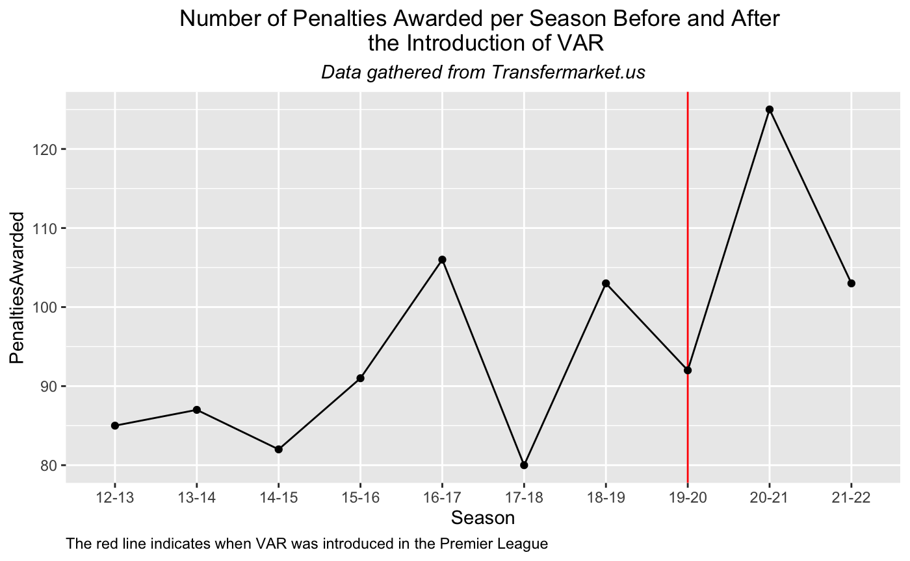

# Premier League Stat Changes

This is my project where I look at how different stats have changed over time in the English Premier League. My first set of objectives will be to see how different stats changed after VAR was introduced. 

## Getting Started

The first thing we will look at is the number of penalties awarded changed once VAR was introduced in the 19-20 season. 

### Change in Number of Penalties Awarded

Please refer to the Penalties.Rmd file for the code and line-by-line explanations. The code generated the graph below, which gives us a preliminary answer to the question posed before.

